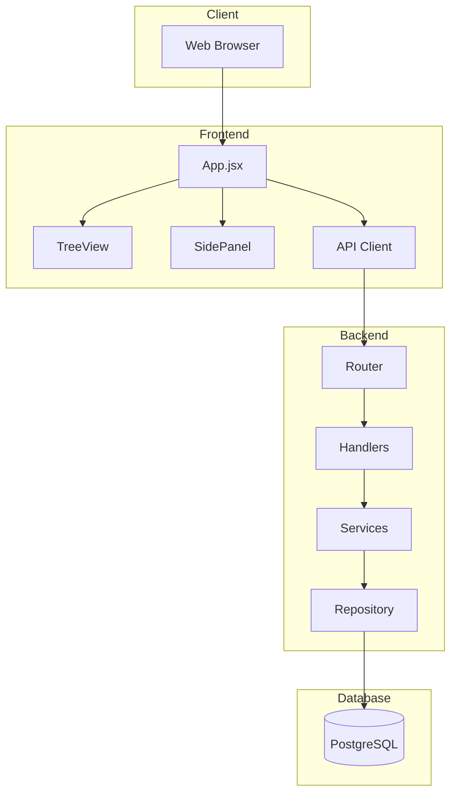
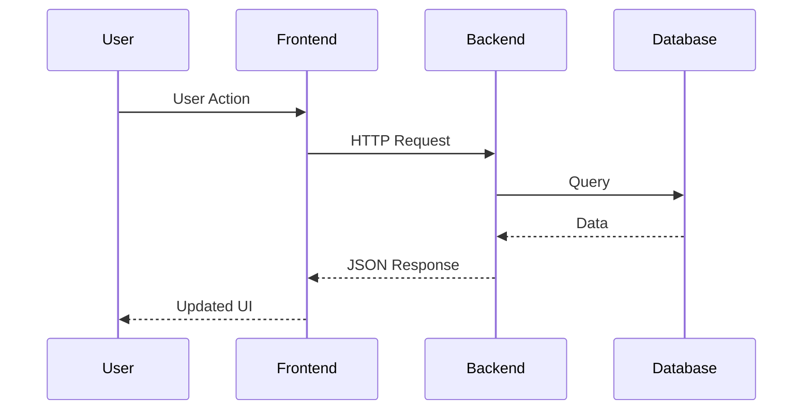
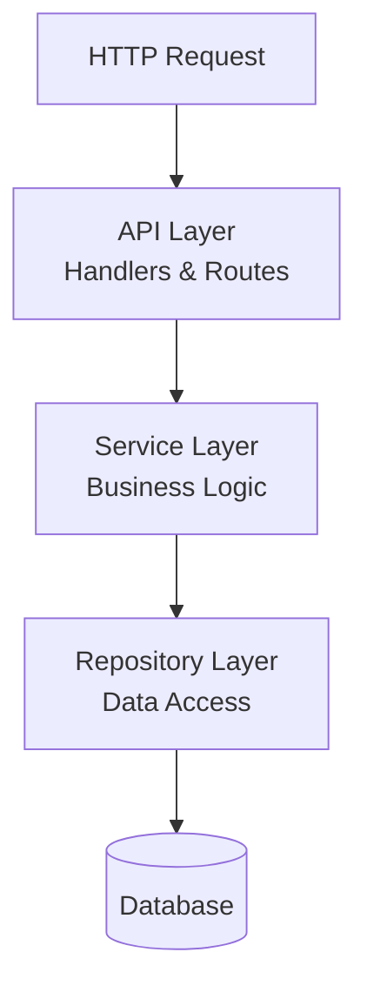
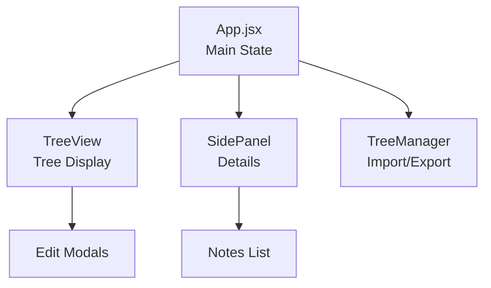
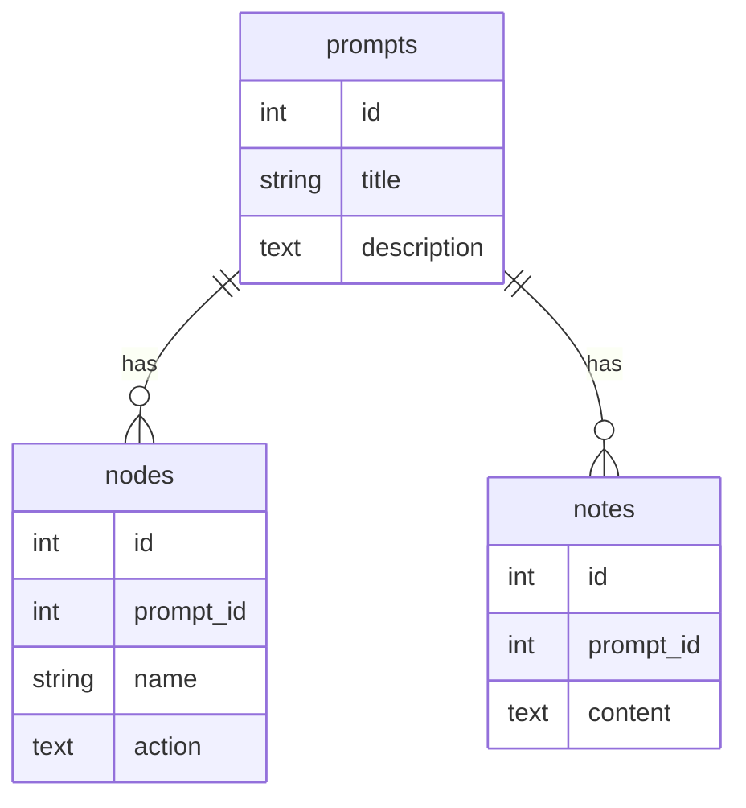
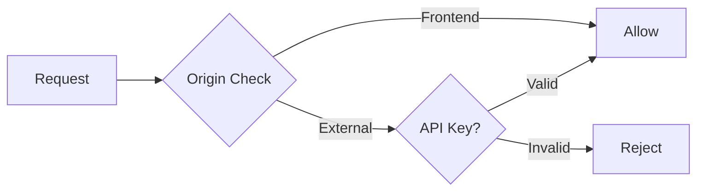
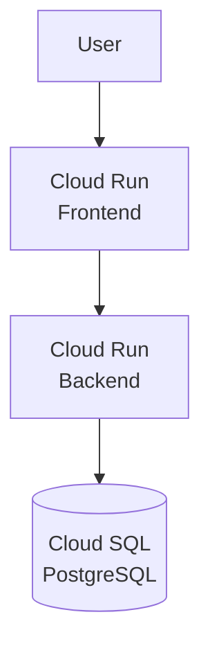

# Architecture Overview

This document explains how the system is structured and how components interact.

## System Architecture

## How Requests Flow

## Backend Layers

The backend uses a **layered architecture** for clear separation:

**Layer Responsibilities:**
- **API Layer**: Handles HTTP requests, validates input, formats responses
- **Service Layer**: Contains business logic and rules
- **Repository Layer**: Manages database queries and data mapping

## Frontend Components

**Key Components:**
- **App.jsx**: Manages application state and coordinates components
- **TreeView**: Displays the interactive tree structure
- **SidePanel**: Shows details for selected prompts
- **TreeManager**: Handles import/export and save/load operations

## Database Structure

**Relationships:**
- Each prompt can have multiple nodes (subprompts)
- Each prompt can have multiple notes (annotations)
- Deletions cascade (deleting a prompt deletes its nodes and notes)

## Security Flow

**Security:**
- Frontend requests (from browser) are automatically allowed
- External requests (curl, etc.) require API key
- API key passed in `Authorization: Bearer <key>` header

## Deployment

**Deployment:**
- Frontend and backend deployed separately on Cloud Run
- Database hosted on Cloud SQL
- All communication over HTTPS
